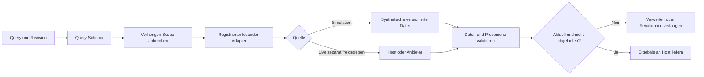
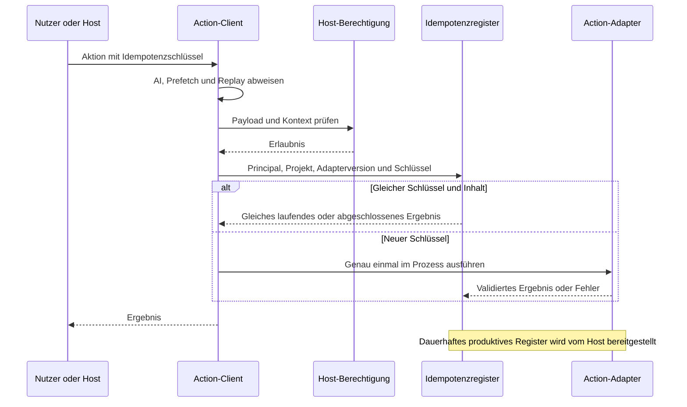
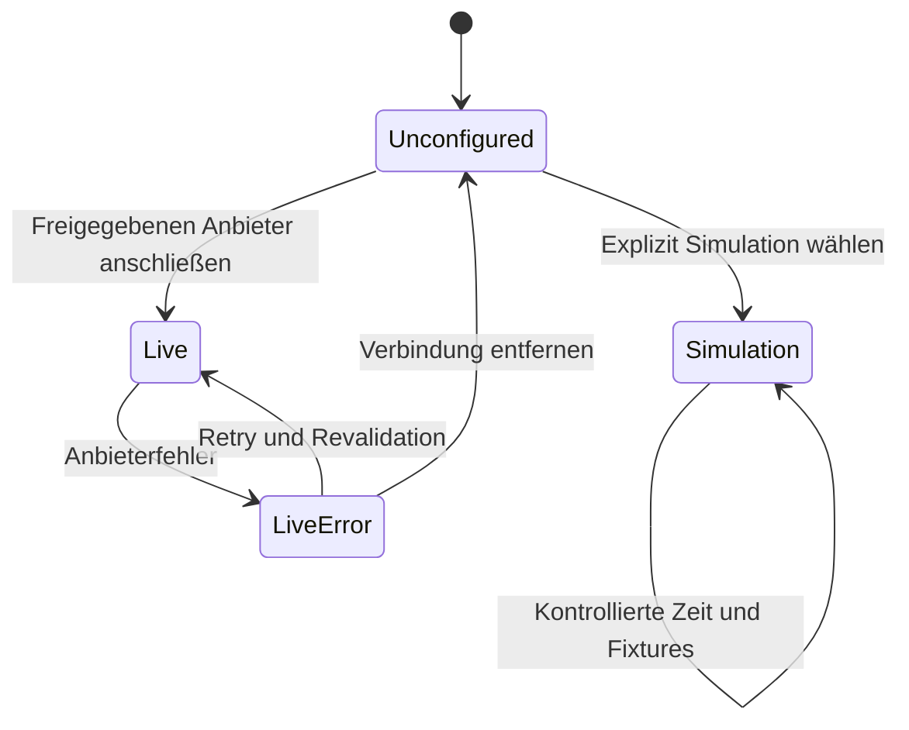

# Daten-, Action- und Simulationsflow

Stand: 1. November 2026. Vertrag: `@fluidkit/core/data`, Provenienz:
`@fluidkit/contracts`. Provideradapter sind ein getrennter Qualifikationsschritt.

```mermaid
flowchart LR
    Query[Query und Revision] --> Validate[Query-Schema]
    Validate --> Abort[Vorherigen Scope abbrechen]
    Abort --> Read[Registrierter lesender Adapter]
    Read --> Source{Quelle}
    Source -->|Simulation| Fixture[Synthetische versionierte Datei]
    Source -->|Live separat freigegeben| Provider[Host oder Anbieter]
    Fixture --> Result[Daten und Provenienz validieren]
    Provider --> Result
    Result --> Guard{Aktuell und nicht abgelaufen?}
    Guard -->|Nein| Discard[Verwerfen oder Revalidation verlangen]
    Guard -->|Ja| Snapshot[Ergebnis an Host liefern]
```

```mermaid
sequenceDiagram
    participant User as Nutzer oder Host
    participant Action as Action-Client
    participant Auth as Host-Berechtigung
    participant Store as Idempotenzregister
    participant Adapter as Action-Adapter
    User->>Action: Aktion mit Idempotenzschlüssel
    Action->>Action: AI, Prefetch und Replay abweisen
    Action->>Auth: Payload und Kontext prüfen
    Auth-->>Action: Erlaubnis
    Action->>Store: Principal, Projekt, Adapterversion und Schlüssel
    alt Gleicher Schlüssel und Inhalt
        Store-->>Action: Gleiches laufendes oder abgeschlossenes Ergebnis
    else Neuer Schlüssel
        Action->>Adapter: Genau einmal im Prozess ausführen
        Adapter-->>Store: Validiertes Ergebnis oder Fehler
    end
    Action-->>User: Ergebnis
    Note over Store,Adapter: Dauerhaftes produktives Register wird vom Host bereitgestellt
```

```mermaid
stateDiagram-v2
    [*] --> Unconfigured
    Unconfigured --> Simulation: Explizit Simulation wählen
    Unconfigured --> Live: Freigegebenen Anbieter anschließen
    Simulation --> Simulation: Kontrollierte Zeit und Fixtures
    Live --> LiveError: Anbieterfehler
    LiveError --> Live: Retry und Revalidation
    LiveError --> Unconfigured: Verbindung entfernen
```
